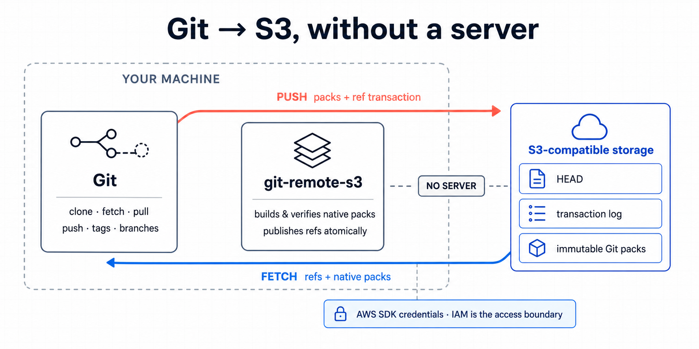

# git3

**Put a Git remote in S3. No server to run.**

git3 is a Git remote helper that stores a complete, ordinary Git repository in an S3 bucket you
control. It works with Amazon S3 and S3-compatible object storage.



## It really is this simple

Bring an existing bucket. AWS credentials and region come from the standard AWS SDK chain.

```sh
git remote add origin s3://my-bucket/repos/example
git push -u origin HEAD:refs/heads/main
```

Then, from anywhere with Git, git3, and access to the bucket:

```sh
git clone s3://my-bucket/repos/example
```

The first branch push creates the repository inside the bucket prefix. The bucket itself must
already exist.

## Supported Git commands

| Command | Notes |
| --- | --- |
| `git clone <s3-url>` | Full clones |
| `git fetch`, `git pull` | Incremental synchronization |
| `git push` | Create and update branches or tags |
| `git push --delete` | Delete branches or tags |
| `git push --force`, `git push --force-with-lease` | Forced updates with S3 compare-and-swap protection |
| `git push --atomic` | Atomic multi-ref pushes |
| `git submodule` with `s3://` URLs | Requires git3 and permission for the `s3` protocol in the submodule environment |

Signed commits and tags are preserved. Both SHA-1 and SHA-256 repositories are supported.

After a clone or fetch, the local repository contains native Git packs. Remove git3 and normal
local commands such as `log`, `checkout`, `fsck`, and `repack` still work.

## What does not

- Shallow or partial clones
- Built-in Git LFS storage (use a separate LFS endpoint)
- Server-side hooks, branch protection, reviews, merge queues, or a web UI
- `git archive --remote`, `upload-pack`, `receive-pack`, or Git wire-protocol server emulation
- Windows release binaries

git3 is storage and synchronization, not a forge. Anyone who can overwrite the reserved S3 prefix
is a repository administrator.

## Install

git3 requires Git 2.38 or newer. Releases are available for Linux and macOS on amd64 and arm64.

```sh
curl -fsSL https://github.com/robertpitt/git3/releases/latest/download/install.sh | sh
```

Or build from source:

```sh
go build ./cmd/git3
```

Install the binary as `git3`, then create `git-s3` and `git-remote-s3` symlinks beside it. For
versioned archives, checksums, Sigstore bundles, and build provenance, see the GitHub release page.

S3-compatible services can be selected with `GIT3_ENDPOINT`; use `GIT3_PATH_STYLE=true` when the
service requires path-style addressing. Credentials, regions, endpoints, and encryption settings do
not belong in the remote URL. See [configuration](docs/configuration.md) for all settings.

## How it works

Git sees `s3://...` and invokes the `git-remote-s3` helper. git3 then:

1. asks native Git to create and verify packfiles;
2. uploads immutable packs and transaction records to the bucket;
3. publishes ref changes with one conditional S3 write, preventing lost concurrent updates; and
4. installs fetched packs directly into `.git/objects/pack`.

A small mutable `HEAD` document points to immutable repository data. Active clients fetch only the
transactions after their last verified cursor; a no-op fetch is one conditional S3 read. Periodic
maintenance compacts packs for efficient cold clones without changing repository history.

Normal clone, fetch, push, and maintenance need no S3 list or delete permission. Garbage collection
is separate, explicit, resumable, and dry-run by default.

```sh
git s3 doctor origin
git s3 fsck origin --full
git s3 maintenance origin
git s3 gc origin                 # preview only
git s3 gc origin --execute --older-than 30d
```

See [operations](docs/operations.md), [least-privilege IAM examples](docs/iam.md), and the normative
[SPEC](SPEC.md).

## Development

```sh
go test ./...
go test -race ./...
go vet ./...
```

Licensed under Apache-2.0.
