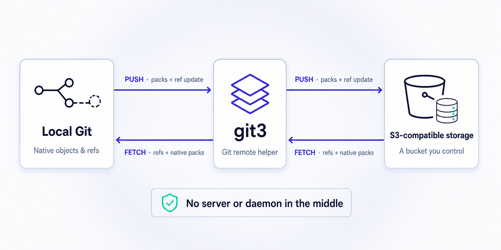

# git3

<p align="center">
  <a href="https://robertpitt.github.io/git3/">Website</a> ·
  <a href="https://github.com/robertpitt/git3/releases">Releases</a> ·
  <a href="docs/configuration.md">Configuration</a> ·
  <a href="docs/operations.md">Operations</a>
</p>

git3 is a Git remote helper that stores a complete, ordinary Git repository in an S3 bucket you
control. It works with Amazon S3 and S3-compatible object storage.



## Install in one line

```sh
curl -fsSL https://github.com/robertpitt/git3/releases/latest/download/install.sh | sh
```

git3 requires Git 2.38 or newer. Releases are available for Linux and macOS on amd64 and arm64.

## Clone

git3 uses the standard AWS SDK credential chain. With credentials already configured:

```sh
git clone s3://my-bucket/repos/example
```

With a named AWS profile:

```sh
AWS_PROFILE=development git clone s3://my-bucket/repos/example
```

Or with credentials supplied as environment variables:

```sh
AWS_ACCESS_KEY_ID=... AWS_SECRET_ACCESS_KEY=... AWS_DEFAULT_REGION=us-east-1 git clone s3://my-bucket/repos/example
```

## Create a remote

Bring an existing bucket, then push a branch. The first branch push creates the repository inside
the bucket prefix; the bucket itself must already exist.

```sh
git remote add origin s3://my-bucket/repos/example
git push -u origin HEAD:refs/heads/main
```

## Supported Git commands

| Command | Notes |
| --- | --- |
| `git clone <s3-url>` | Full clones |
| `git fetch`, `git pull` | Incremental synchronization |
| `git push` | Create and update branches or tags |
| `git push --delete` | Delete branches or tags |
| `git push --force`, `git push --force-with-lease` | Forced updates with S3 compare-and-swap protection |
| `git push --atomic` | Atomic multi-ref pushes |
| `git submodule` with `s3://` URLs | Requires git3 and permission for the `s3` protocol in the submodule environment |

Signed commits and tags are preserved. Both SHA-1 and SHA-256 repositories are supported.

Interactive clone, fetch, and push operations report native Git packing/indexing progress together
with S3 pack-transfer and publication phases. Git's `--quiet` option suppresses this progress while
warnings and errors continue to use stderr.

After a clone or fetch, the local repository contains native Git packs. Remove git3 and normal
local commands such as `log`, `checkout`, `fsck`, and `repack` still work.

## What does not

- Shallow or partial clones
- Built-in Git LFS storage (use a separate LFS endpoint)
- Server-side hooks, branch protection, reviews, merge queues, or a web UI
- `git archive --remote`, `upload-pack`, `receive-pack`, or Git wire-protocol server emulation
- Windows release binaries

git3 is storage and synchronization, not a forge. Anyone who can overwrite the reserved S3 prefix
is a repository administrator.

S3-compatible services can be selected with `GIT3_ENDPOINT`; use `GIT3_PATH_STYLE=true` when the
service requires path-style addressing. Credentials, regions, endpoints, and encryption settings do
not belong in the remote URL. See [configuration](docs/configuration.md) for all settings.

## How it works

Git sees `s3://...` and invokes the `git-remote-s3` helper. git3 then:

1. asks native Git to create and verify packfiles;
2. uploads immutable packs and transaction records to the bucket;
3. publishes ref changes with one conditional S3 write, preventing lost concurrent updates; and
4. installs fetched packs directly into `.git/objects/pack`.

A small mutable `HEAD` document points to immutable repository data. Active clients fetch only the
transactions after their last verified cursor; a no-op fetch is one conditional S3 read. Periodic
maintenance compacts packs for efficient cold clones without changing repository history.

Normal clone, fetch, push, and maintenance need no S3 list or delete permission. Garbage collection
is separate, explicit, resumable, and dry-run by default.

```sh
git s3 doctor origin
git s3 fsck origin --full
git s3 maintenance origin
git s3 gc origin                 # preview only
git s3 gc origin --execute --older-than 30d
```

See [operations](docs/operations.md), [least-privilege IAM examples](docs/iam.md),
[event-driven builds with S3, Lambda, and CodeBuild](docs/s3-events.md), and the normative
[SPEC](SPEC.md).

## Development

```sh
go test ./...
go test -race ./...
go vet ./...
```

## Build from source

```sh
go build -o git3 ./cmd/git3
ln -s git3 git-s3
ln -s git3 git-remote-s3
```

Keep all three files together on your `PATH`. For versioned archives, checksums, Sigstore bundles,
and build provenance, see the GitHub release page.

Licensed under Apache-2.0.
